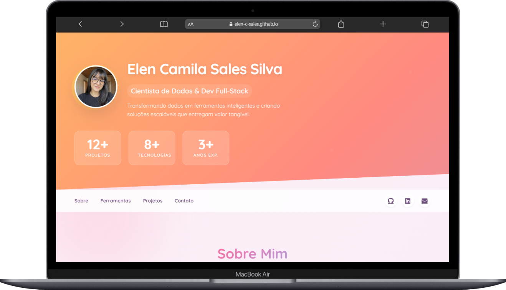
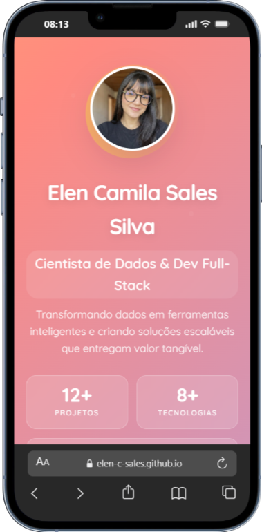

# Portfólio: Elen Camila Sales Silva
### Cientista de Dados & Desenvolvedora Full-Stack

Este repositório contém o código-fonte do meu portfólio profissional, desenvolvido com foco em apresentar meus projetos de **Data Science**, **Machine Learning** e **Desenvolvimento Web**.

## Demo Online
Acesse o portfólio interativo: [https://elen-c-sales.github.io/](https://elen-c-sales.github.io/)

## Visualização do Projeto
O design utiliza o conceito de **Glassmorphism** e gradientes modernos, totalmente responsivo para dispositivos móveis e desktop.

  <table>
    <tr>
      <td align="center" width="60%">
        
         
        <em>Desktop: Painel de Projetos e Skills</em>
      </td>
      <td align="center" width="35%">
        
         
        <em>Mobile: Navegação Fluida</em>
      </td>
    </tr>
  </table>

## Stack Tecnológico deste Site
Embora meus projetos principais sejam em Python/R, este portfólio foi construído utilizando tecnologias Front-end modernas para garantir performance e SEO:

* **HTML5 Semântico**
* **CSS3 Avançado** (CSS Variables, Flexbox, Grid, Keyframe Animations)
* **JavaScript Vanilla** (Scroll Reveal, Contadores Dinâmicos)
* **FontAwesome** (Ícones)

## Projetos Destacados
No portfólio você encontrará links para:
* **Elen4Devs:** Suíte de utilitários para desenvolvedores.
* **Inadimplência Dashboard:** Análise de dados financeiros com R Shiny.
* **ZenCalc:** App mobile desenvolvido com React Native.
* **Weather Dash:** Pipeline de dados climáticos com Python.

---
*Desenvolvido com 💜 e Dados por Elen Camila Sales Silva.*
